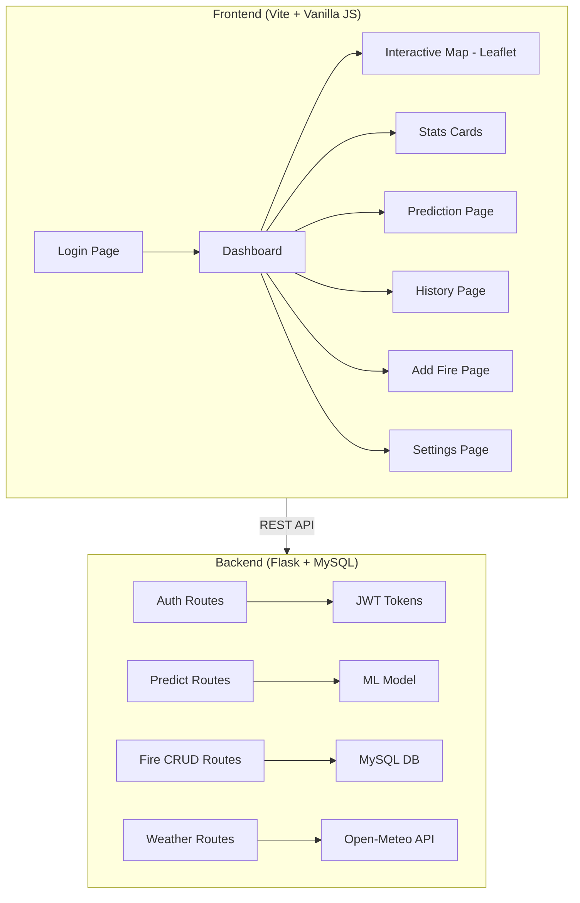

# 🔥 Forest Fire Prediction System — Implementation Plan

## Overview

Build a complete intelligent forest fire prediction platform on top of the **existing** Flask backend and ML model. The system covers authentication, an interactive map dashboard, AI-powered predictions, fire history management, and system settings.

## Existing Codebase Summary

| Component | Status |
|---|---|
| ML Model (`model.pkl`, `features.pkl`, `forest_context.pkl`) | ✅ Ready |
| Flask API (`/predict_top`, `/predict_forest`, `/add_fire`) | ✅ Ready |
| Weather API integration (Open-Meteo) | ✅ Ready |
| Frontend | ❌ Not started |
| MySQL Database | ❌ Not started |
| Authentication | ❌ Not started |
| Fire History CRUD | ❌ Not started |

---

## Architecture



---

## Technology Choices

| Layer | Technology | Rationale |
|---|---|---|
| Frontend | **Vite + Vanilla JS** | Fast dev server, no framework overhead, matches spec |
| Styling | **Vanilla CSS** | Full control, premium design with CSS variables |
| Map | **Leaflet + OpenStreetMap** | Free, no API key, powerful |
| Backend | **Flask** (existing) | Already built, extend with new routes |
| Database | **MySQL** | As specified in requirements |
| Auth | **JWT (flask-jwt-extended)** | Stateless, standard for SPAs |
| Weather | **Open-Meteo API** (existing) | Already integrated |

---

## User Review Required

> [!IMPORTANT]
> **MySQL Connection**: I'll need your MySQL credentials (host, port, username, password, database name). For now, I'll use `localhost:3306`, user `root`, password `""`, database `project_fire`. Please confirm or provide your actual credentials.

> [!IMPORTANT]
> **Map Region**: The existing weather API uses coordinates `36.4621, 7.4261` (Constantine/Guelma region, Algeria). The map will be centered on this region. Please confirm this is correct.

> [!WARNING]
> **No real forest coordinates exist** in the current `forest_context.pkl`. I'll assign approximate coordinates based on the Algerian forest names for map display. These can be refined later with real GPS data.

---

## Open Questions

1. **Language**: The spec mentions "language change" in settings. Should the app support French and Arabic, or just French?
2. **MySQL credentials**: What are your MySQL connection details?
3. **Weather API for current data**: The existing code uses the Open-Meteo **archive** API. Should I also integrate the **forecast** API for real-time dashboard weather stats?

---

## Proposed Changes

---

### Phase 1: Database Setup (MySQL)

#### [NEW] [schema.sql](file:///d:/Desktop/PROJECT-FIRE/Server/schema.sql)
MySQL schema with the following tables:
- `users` — id, username, email, password_hash, role, language, created_at
- `fires` — id, forest_name, daira, commune, latitude, longitude, date, surface_burned, cause, severity, notes, created_by, created_at
- `forests` — id, name, daira, commune, latitude, longitude, risk_level
- Seed data: admin user (admin/admin123), forests from `forests_alphabetical.csv`

#### [NEW] [db.py](file:///d:/Desktop/PROJECT-FIRE/Server/utils/db.py)
MySQL connection pool using `mysql-connector-python`. Provides `get_db()` context manager.

---

### Phase 2: Backend — Authentication & New Routes

#### [MODIFY] [main.py](file:///d:/Desktop/PROJECT-FIRE/Server/main.py)
- Add CORS support (`flask-cors`)
- Add JWT configuration (`flask-jwt-extended`)
- Register new blueprints: `auth_bp`, `fires_bp`, `weather_bp`, `users_bp`, `forests_bp`
- Add static file serving for frontend

#### [NEW] [routes/auth.py](file:///d:/Desktop/PROJECT-FIRE/Server/routes/auth.py)
- `POST /api/auth/login` — Login with username/password, returns JWT
- `POST /api/auth/register` — Create account
- `POST /api/auth/reset-password` — Password reset

#### [NEW] [routes/fires.py](file:///d:/Desktop/PROJECT-FIRE/Server/routes/fires.py)
- `GET /api/fires` — List all fires (with pagination, search, date filtering)
- `GET /api/fires/:id` — Get single fire
- `POST /api/fires` — Add new fire (replaces existing add_fire route)
- `PUT /api/fires/:id` — Update fire
- `DELETE /api/fires/:id` — Delete fire
- `GET /api/fires/stats` — Aggregate statistics (count this month, heatmap data)

#### [NEW] [routes/weather.py](file:///d:/Desktop/PROJECT-FIRE/Server/routes/weather.py)
- `GET /api/weather/current` — Current weather (temperature, humidity, wind) from Open-Meteo forecast API

#### [NEW] [routes/users.py](file:///d:/Desktop/PROJECT-FIRE/Server/routes/users.py)
- `GET /api/users` — List users (admin only)
- `PUT /api/users/:id` — Update user profile
- `PUT /api/users/:id/password` — Change password

#### [NEW] [routes/forests.py](file:///d:/Desktop/PROJECT-FIRE/Server/routes/forests.py)
- `GET /api/forests` — List all forests with coordinates and risk levels
- `GET /api/forests/:name` — Get forest details

#### [MODIFY] [routes/predict_top.py](file:///d:/Desktop/PROJECT-FIRE/Server/routes/predict_top.py)
- Add `/api/` prefix to routes
- Add JWT protection

#### [MODIFY] [routes/predict_forest.py](file:///d:/Desktop/PROJECT-FIRE/Server/routes/predict_forest.py)
- Add `/api/` prefix to routes
- Add JWT protection

#### [NEW] [requirements.txt](file:///d:/Desktop/PROJECT-FIRE/Server/requirements.txt)
```
flask
flask-cors
flask-jwt-extended
mysql-connector-python
pandas
joblib
scikit-learn
requests
bcrypt
```

---

### Phase 3: Frontend — Project Setup & Design System

#### [NEW] Frontend project at `d:\Desktop\PROJECT-FIRE\Client\`

Initialize with Vite (vanilla JS template):

```
Client/
├── index.html
├── package.json
├── vite.config.js
├── public/
│   └── favicon.svg
└── src/
    ├── main.js            # App entry, router
    ├── router.js           # SPA hash-based router
    ├── api.js              # API client (fetch wrapper with JWT)
    ├── auth.js             # Auth state management
    ├── styles/
    │   ├── index.css       # Design system (variables, reset, utilities)
    │   ├── components.css  # Shared component styles
    │   ├── auth.css        # Auth page styles
    │   ├── dashboard.css   # Dashboard page styles
    │   ├── prediction.css  # Prediction page styles
    │   ├── history.css     # History page styles
    │   ├── addfire.css     # Add fire page styles
    │   └── settings.css    # Settings page styles
    ├── pages/
    │   ├── login.js        # Login/Register page
    │   ├── dashboard.js    # Dashboard with map + stats
    │   ├── prediction.js   # Fire prediction form + results
    │   ├── history.js      # Fire history table + filters
    │   ├── addfire.js      # Add fire form with map picker
    │   └── settings.js     # System settings
    └── components/
        ├── sidebar.js      # Navigation sidebar
        ├── header.js       # Top header with user info
        ├── map.js          # Leaflet map component
        ├── statscard.js    # Statistics card component
        └── chart.js        # Chart component
```

---

### Phase 4: Frontend — Page Implementation

#### 4.1 Authentication Page
- Sleek dark-themed login with glassmorphism card
- Toggle between Login / Register forms
- Animated fire background (CSS gradient animation)
- Form validation with real-time feedback
- JWT token stored in localStorage

#### 4.2 Dashboard Page
- **Sidebar**: Navigation with icons (🗺️ Dashboard, 🔮 Prediction, 📜 History, ➕ Add Fire, ⚙️ Settings)
- **Interactive Map (Leaflet)**:
  - Centered on Algeria (36.46°N, 7.43°E)
  - Forest markers color-coded by risk level (green/yellow/orange/red)
  - Click marker → popup with forest name, risk %, weather
  - Heatmap layer for historical fires (using `leaflet.heat`)
  - Toggle layers: forests, danger zones, current fires, past fires
- **Stats Cards**: 
  - Fires this month (count)
  - Most dangerous zone
  - Current temperature
  - Humidity
  - Wind speed
  - All with icons and animated counters

#### 4.3 Prediction Page
- Forest selection dropdown (from `/api/forests`)
- Weather data auto-populated from API
- Manual override option for weather fields
- **Results display**:
  - Large animated risk percentage gauge
  - Risk level badge (color-coded)
  - Contributing factors breakdown
  - Recommendation text based on risk level

#### 4.4 Fire History Page
- Sortable data table with columns: Date, Forest, Location, Area Burned, Cause, Severity
- Search bar (filter by forest name)
- Date range picker filter
- Statistics summary cards at top
- Export option (future)

#### 4.5 Add Fire Page
- Form with map picker for location selection
- Click map → fills latitude/longitude
- Fields: Forest name, date, area burned, cause (dropdown), severity (slider), notes
- Form validation
- Success notification with animation

#### 4.6 Settings Page
- Profile section: Edit name, email
- Password change form
- Language toggle (French/English)
- User management table (admin only)

---

### Phase 5: Design System

Premium dark theme with fire-inspired accents:

```css
:root {
  /* Base colors */
  --bg-primary: #0a0e17;
  --bg-secondary: #111827;
  --bg-card: #1a2332;
  --bg-glass: rgba(26, 35, 50, 0.8);
  
  /* Fire accent gradient */
  --fire-orange: #ff6b35;
  --fire-red: #e63946;
  --fire-yellow: #ffd166;
  
  /* Risk colors */
  --risk-low: #06d6a0;
  --risk-medium: #ffd166;
  --risk-high: #ff6b35;
  --risk-critical: #e63946;
  
  /* Text */
  --text-primary: #f1f5f9;
  --text-secondary: #94a3b8;
  
  /* Typography */
  --font-main: 'Inter', sans-serif;
}
```

Key design features:
- Dark mode throughout
- Glassmorphism cards with backdrop-filter
- Smooth gradient backgrounds
- Micro-animations on hover/focus
- Fire-themed orange/red accent colors
- Responsive layout (sidebar collapses on mobile)

---

### Phase 6: Integration & Polish

- Connect all frontend pages to backend API
- Add loading states and error handling
- Test all routes and flows
- Ensure responsive design
- Add favicon and page titles

---

## Verification Plan

### Automated Tests
1. Start Flask backend: `python main.py` in `Server/`
2. Start Vite dev server: `npm run dev` in `Client/`
3. Browser test: Navigate through all pages via browser subagent
4. API test: Verify all endpoints return correct data

### Manual Verification
- Visual inspection of all pages via browser screenshots
- Test login → dashboard → prediction → history → add fire → settings flow
- Verify map renders with forest markers
- Verify prediction returns risk percentage
- Verify fire history table populates
